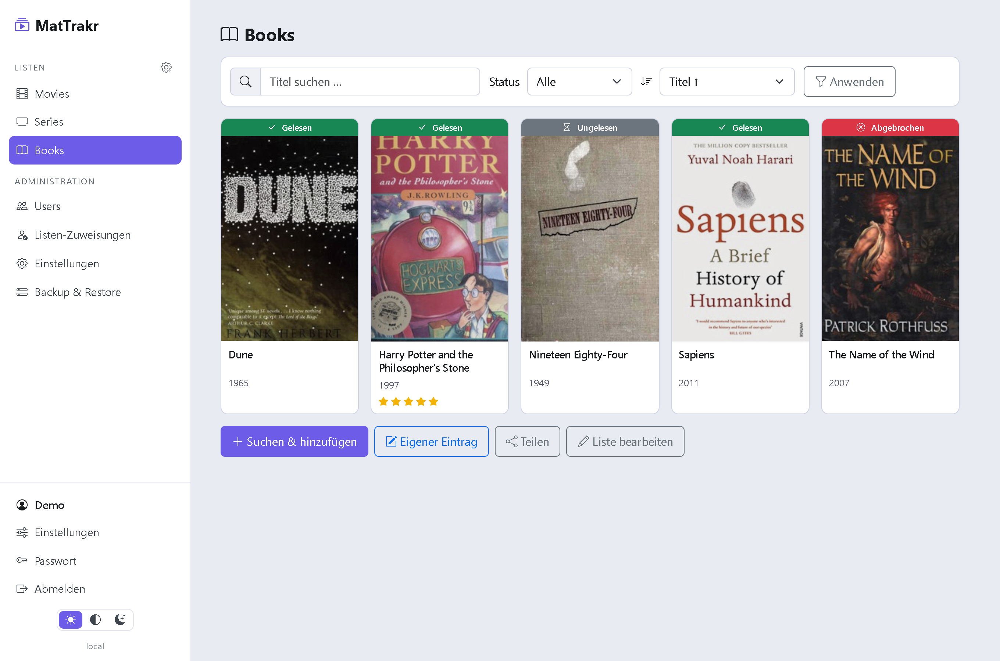
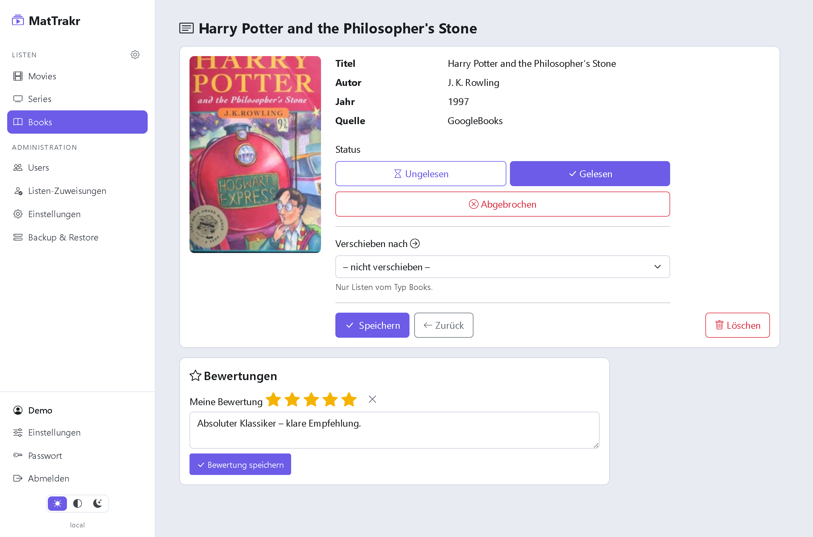
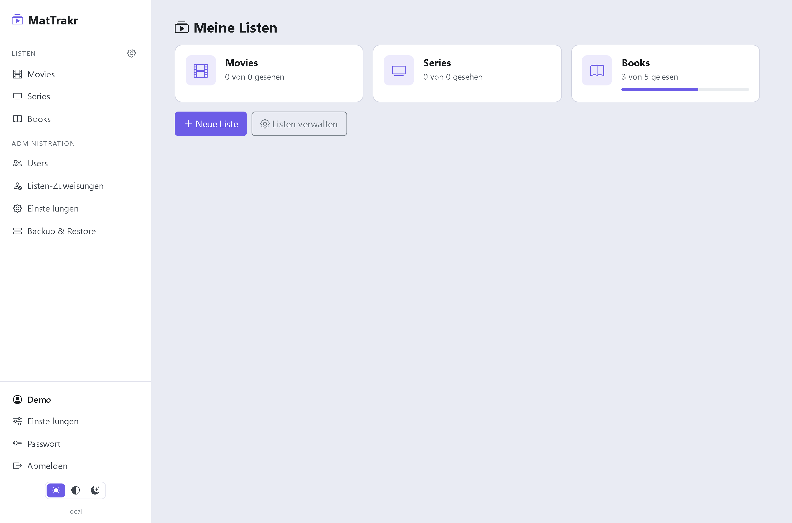
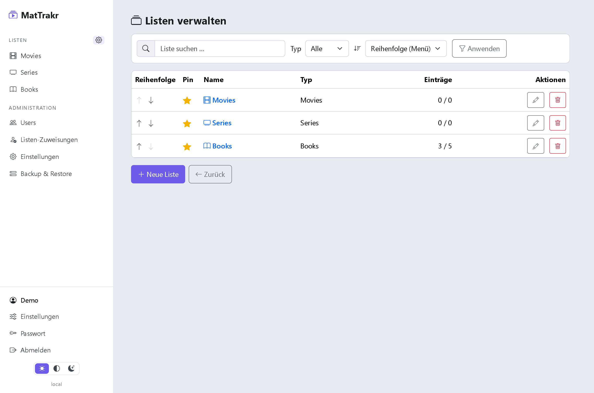
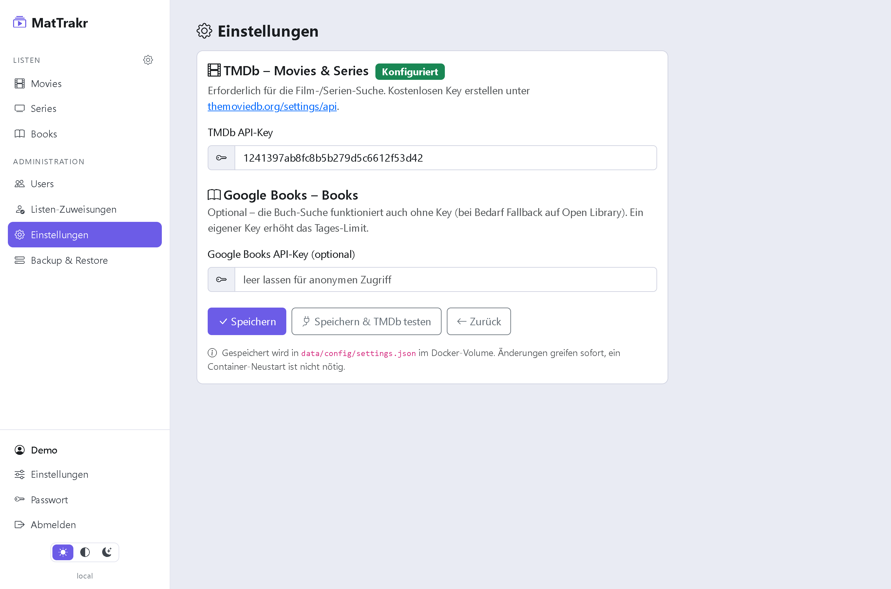
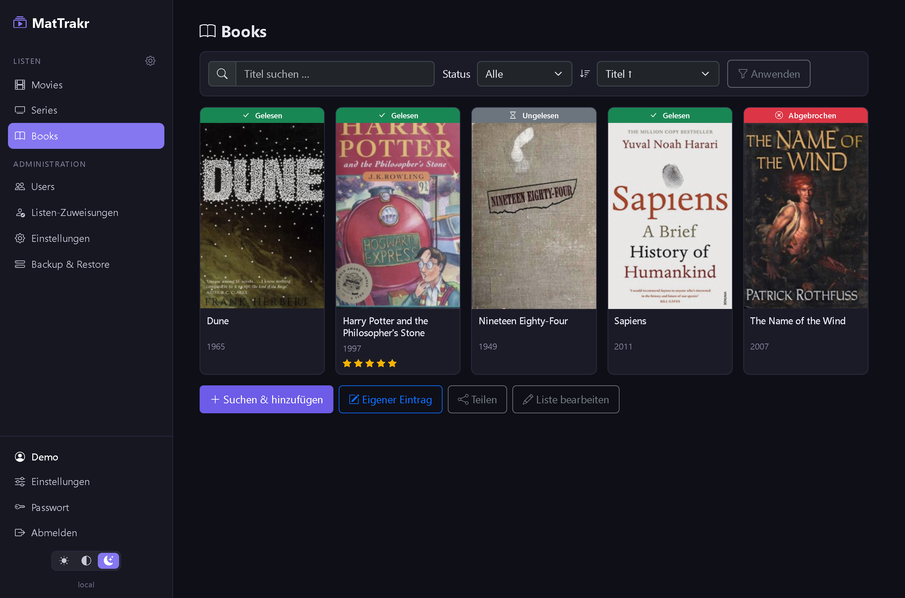
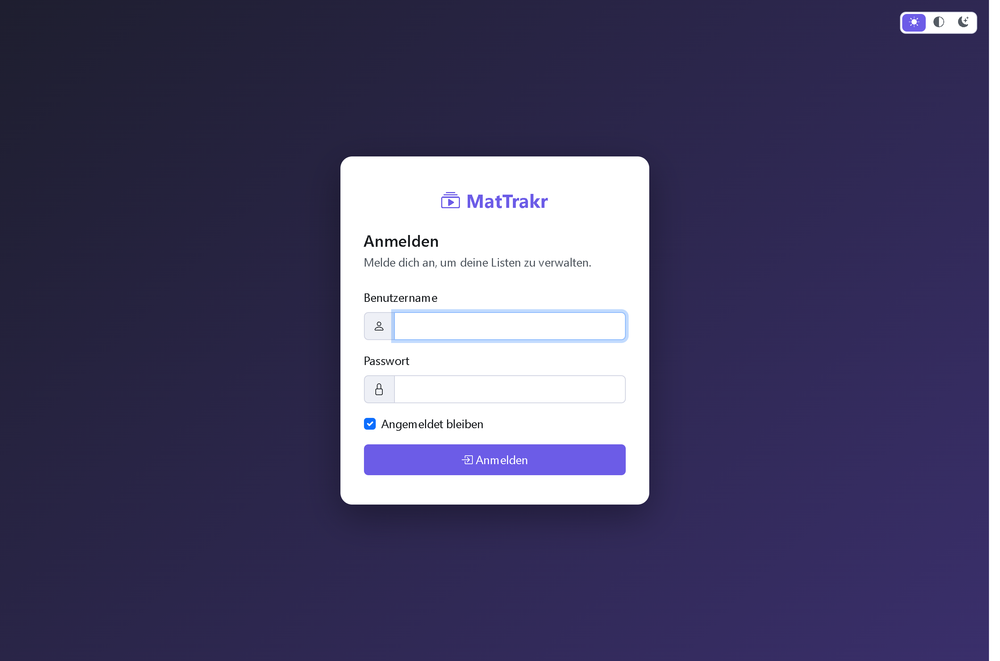

<div align="center">


# MatTrakr

**Keep track of what you have read and watched — in the browser.**

Your own lists for movies, series and books, with real cover art, seasons, personal
ratings and sharing. One container, no cloud, no third-party account.

</div>



---

## What this is about

Streaming apps forget what you meant to watch, and a note on your phone forgets the cover.
MatTrakr is a small, self-hosted tracker: create lists for **movies, series and books**,
search real metadata with posters from TMDb and Google Books, mark what you have seen or read,
and rate it. Lists are personal but can be **shared** — so a household can see who watched what
and how everyone liked it. It runs as a single container and stores everything in one SQLite
file.

## At a glance

**Lists & items**
- Personal lists per user; **Movies, Series and Books** are created automatically for every new account
- **Realtime search with covers**: TMDb for movies and series, Google Books for books
  (with an Open Library fallback when Google is rate-limited)
- **Add your own entries by hand** — title, year, author/original title, description and an
  uploaded cover image (stored in the database, so it is part of the backup)
- Move items between lists (only within the same type), no duplicates per list
- Toolbar with search, filter and sort above every list; a fullscreen filter dialog on mobile

**Progress & ratings**
- Status **Ungesehen / Gesehen** (or **Ungelesen / Gelesen**), plus **Teilweise** and **Abgebrochen**
- **Per-season tracking** for series: tick the seasons you have seen with quick *All / Half / None*
  buttons; the status follows automatically
- **Personal 5-star ratings** with an optional comment — one per person per item; everyone with
  access to the list sees *who* rated it *how*

**Sharing & roles**
- Share a list with a **registered user** (read-only or edit), or hand out a **public read-only
  link** (secret token, no login needed)
- Roles **Admin, Verwalter, User**; an admin can **assign** a Verwalter to edit someone else's list

**Personalisation**
- **Light, dark and system** themes; the whole UI, including the menu, adapts
- **Pin lists as favourites** to the sidebar and put them in your **own order**
- Choose where the status tag sits on a cover (above, or larger below)
- **Installable as a PWA** (add to home screen), mobile-first layout

**Operations**
- Local sign-in, **DB-backed sessions that survive a container restart**
- **Backup & Restore** in the admin area: download the database, or replace it from a file
  (a safety copy of the previous state is kept)
- API keys are managed in the UI (*Administration → Einstellungen*) and take effect without a restart

## Screenshots

### Item detail — status shortcuts, seasons and personal rating



Every type shares the same layout: status shortcuts (for series plus a per-season picker),
an optional move, then the personal rating with a comment and everyone else's ratings below.

### Home, list management and administration

| Home | Listen verwalten | Administration |
|---|---|---|
|  |  |  |

The home page shows every list with progress; *Listen verwalten* lets you rename, delete,
**pin lists to the sidebar** and put them in your **own order**; the admin area holds users,
list assignments, settings and backup.

### Dark theme and sign-in

| Dark theme | Sign-in |
|---|---|
|  |  |

## Quick start

Ready-made images are published to the GitHub Container Registry:

| Tag | Built from | Use it for |
|---|---|---|
| `ghcr.io/real-ttx/mattrakr:latest` | `main` | releases |
| `ghcr.io/real-ttx/mattrakr:nightly` | `dev` | the newest features |

### 1. Just run it

Copy this into `docker-compose.yml` and start it:

```yaml
services:
  mattrakr:
    image: ghcr.io/real-ttx/mattrakr:latest
    container_name: mattrakr
    restart: unless-stopped
    ports:
      - "9242:9242"
    volumes:
      - mattrakr-data:/app/data

volumes:
  mattrakr-data:
```

```bash
docker compose up -d
```

Open **http://localhost:9242** and sign in with **`admin` / `admin`** — you are asked for a
password of your own right away. The `mattrakr-data` volume keeps the database, the configuration
and the session keys, so an update is just `docker compose pull && docker compose up -d`.

Without Compose:

```bash
docker run -d --name mattrakr -p 9242:9242 -v mattrakr-data:/app/data \
  ghcr.io/real-ttx/mattrakr:latest
```

### 2. Add the cover search

Book search works out of the box. **Movies and series need a free TMDb API key**: create one at
[themoviedb.org/settings/api](https://www.themoviedb.org/settings/api), then paste it in the UI
under **Administration → Einstellungen** and hit *Save & test TMDb*. It takes effect immediately —
no restart. A Google Books key is optional and only raises the daily quota.

You can also set the keys ahead of time as environment variables (`Tmdb__ApiKey`,
`GoogleBooks__ApiKey`) or in the mounted `data/config/settings.json`.

### 3. From source

```bash
docker compose -f docker-compose.release.yml up -d          # runs the published image
docker compose -f docker-compose.dev.yml up -d --build      # development stack (local build)
```

Locally without Docker:

```bash
dotnet run --project src/MatTrakr
```

### Settings that matter

| Variable | Default | Meaning |
|---|---|---|
| `ASPNETCORE_URLS` | `http://+:9242` | Address/port inside the container |
| `Storage__DataPath` | `/app/data` | Data directory (SQLite, config, keys) |
| `MATTRAKR_ADMIN_PASSWORD` | `admin` | Initial password for `admin` on first start |
| `Tmdb__ApiKey` | – | TMDb key for movie/series search (or set it in the UI) |
| `GoogleBooks__ApiKey` | – | Optional Google Books key (higher quota) |

### The `/app/data` volume

```
/app/data
├─ mattrakr.db     SQLite database (lists, items, covers, ratings, users, sessions)
├─ config/         settings.json (API keys, admin-editable)
└─ keys/           DataProtection keys (sessions & antiforgery survive restarts)
```

Cover images for manual entries live **inside the database**, not on disk — a backup of
`mattrakr.db` is therefore complete. External covers (TMDb/Google) are only stored as URLs.

## How it is built

- **ASP.NET Core 10** Razor Pages, **EF Core** with SQLite, custom cookie auth with DB-backed sessions
- Reusable UI controls (table toolbar, pagination, form actions, tabs); **plain JavaScript**, no build step
- Metadata via `IHttpClientFactory` — TMDb, Google Books, Open Library fallback
- Uploaded covers as BLOBs in a separate table, served from `/media/cover/{id}`
- Passwords hashed with `PasswordHasher`, DataProtection keys persisted to the volume

## Branches & versioning

| Branch | Purpose | Version |
|---|---|---|
| `main` | Release | `<major>.<minor>.<build>-<yyyyMMdd>` |
| `dev` | Development | `nightly-<build>-<yyyyMMdd>` |
| local | – | `local-<yyyyMMdd>` |

`Major`/`Minor` live in [`VERSION`](VERSION), the build number comes from the GitHub action
(`github.run_number`). Every push to `main`/`dev` publishes an image to the GitHub Container
Registry.
